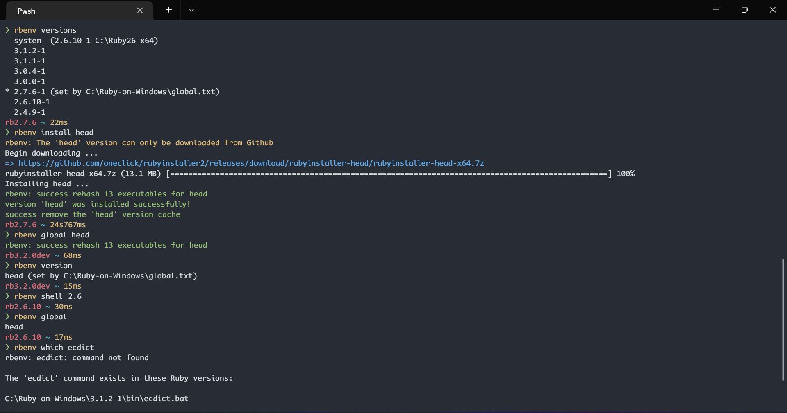

<div align="center">

<h1 align="center">rbenv for Windows</h1>

<p>

<a href="https://matrix.to/#/#rbenv-for-windows_community:gitter.im">
    
</a>

<a href="https://github.com/ccmywish/rbenv-for-windows/blob/main/LICENSE">
    
</a>

</p>

Manage multiple Rubies on Windows.

</div>

<br>

嗨, 你好

Hi, hello

`rbenv for Windows` is a `rbenv` clone for Ruby users on Windows. **If you're interested in how it works, read these sections for quick and enough information:**

1. [Relation with rbenv and RubyInstaller2](./doc/principle.md#RelationWithOtherProjects)
2. [How does it work?](./doc/principle.md#HowDoesItWork)
3. [FAQ for maintainers](./doc/principle.md#FAQforDevs)
4. [Environment Variables](#EnvVar)

There's a [benchmark](./doc/benchmark.md) to show if `rbenv` will influence Ruby/Gem commands startup time significantly.

<br>

## Screenshot



<br>

## Install

**Requirements:**

- Windows 7 SP1+ / Windows Server 2008+
- [PowerShell 5](https://aka.ms/wmf5download) (or later, include [PowerShell Core](https://docs.microsoft.com/en-us/powershell/scripting/install/installing-powershell-core-on-windows?view=powershell-6)) and [.NET Framework 4.5](https://www.microsoft.com/net/download) (or later)
- PowerShell must be enabled for your user account e.g. `Set-ExecutionPolicy -ExecutionPolicy RemoteSigned -Scope CurrentUser`

<br>

**It's portable, be bold to try it now:**

### For common users

```PowerShell
mkdir "C:\Ruby-on-Windows"
git -C "C:\Ruby-on-Windows" clone "https://github.com/ccmywish/rbenv-for-windows" rbenv
curl -L https://github.com/ccmywish/rbenv-for-windows/releases/download/v1.3.0/fake-ruby-v0.1.0.exe -o "C:\Ruby-on-Windows\rbenv\bin\ruby.exe"
```

In your `$profile`, you should add theses:

```PowerShell
# rbenv for Windows
$env:RBENV_ROOT = "C:\Ruby-on-Windows"

# Not easy to download on Github?
# Use a custom mirror!
# $env:RBENV_USE_MIRROR = "https://abc.com/abc-<version>"

& "$env:RBENV_ROOT\rbenv\bin\rbenv.ps1" init
```

<br>

### For Chinese users

中国大陆用户请使用以下方式

```PowerShell
mkdir "C:\Ruby-on-Windows"
git -C "C:\Ruby-on-Windows" clone "https://gitee.com/ccmywish/rbenv-for-windows" rbenv
curl -L https://gitee.com/ccmywish/rbenv-for-windows/releases/download/v1.3.0/fake-ruby-v0.1.0.exe -o "C:\Ruby-on-Windows\rbenv\bin\ruby.exe"
```

在你的 `$profile` 中, 添加这些内容:

```PowerShell
# rbenv for Windows
$env:RBENV_ROOT = "C:\Ruby-on-Windows"

# 我为大陆用户预置了镜像, 请查看 share/mirrors.ps1
# 请注意，这个必须放在 'init' 之前
$env:RBENV_USE_MIRROR = "CN"  # For Chinese users

& "$env:RBENV_ROOT\rbenv\bin\rbenv.ps1" init
```

<br>

## Usage

**Note:** You can omit many numbers when you specify a version!

Try use
- `rbenv global 3`
- `rbenv local 2.`
- `rbenv install 3.1`

```PowerShell
# List recent Ruby versions
rbenv install -l

# List all Ruby versions
rbenv install -a

# Hooray! So easy to try Ruby dev branch!
rbenv install head

# Install Ruby 3.1.2-1
rbenv install 3.1.2

rbenv install 3.0.0-1

# Install devkit

# No need to run it by yourself now,
# It will run automatically when first setup rbenv
rbenv install msys
# or
rbenv install msys2
# or
rbenv install devkit

# List all installed versions
rbenv versions

# Set global version
rbenv global 3.0.0-1
# Check global version
rbenv global

# Set local version
rbenv local 3.1.2-1

# Check versions
rbenv versions

# Set Ruby version in this shell
rbenv shell 3.0.0-1

# Show current version
rbenv version

# Unset Ruby version in this shell
rbenv shell --unset

rbenv uninstall 3.1.2

# Update rbenv itself!
rbenv update
```

**Note:**

From `3.1.0-1`, we should download `rubyinstaller-<version>.7z` directly, no devkit. That's only about 15MB. **Every Ruby shares one MSYS64.**

However, before `3.1.0-1`, we have to download `rubyinstaller-devkit-<version>.7z`, with devkit. That's about 130MB ... **Every Ruby has their own MSYS64.**

<br>

## Known issues

**The current implementation has these drawbacks and issues:**

1. Bad integration with `Bundler`:

1.1 [Bundle install will not trigger hooks to rehash](https://github.com/ccmywish/rbenv-for-windows/issues/5).

    I don't know if these are bugs of Bundler on Windows, please help this project if you can. As a compromise, I only have to `rbenv rehash version xxx` after you `rbenv global xxx`. This is a simple method to make shims dir always full with kinds of shims.

1.2 `Bundle exec` will fail.

    This is because `bundler` will search gem executable in `PATH`. However, all `.bat`/`.cmd` files are not exposed to `PATH`. This is difficult and there's no way to handle temporarily. Just use an gem executable with version specified yourself!

2. We only support CRuby, x64 versions, provided by RubyInstaller2

    Sorry for that I have no plan to add x86 versions and other Ruby implementations like mruby, JRuby, TruffleRuby and so on. If you want to support it, consider to be a maintainer please! Thank you!

3. We don't support old versions that have a little different leading URL

    Very small URL changes will make our work double, I don't have time for it. So keep URLs convention stable is very important. Luckily, these exceptions are very old Ruby versions (part of 2.4, 2.5 series) built by RubyInstaller, don't worry! See [share/README.md](./share/README.md) for details.

<br>

<a id="EnvVar"> </a>
## Environment Variables

### rbenv user defined

name | example | description
-----|---------|------------
`$env:RBENV_ROOT` | e.g.: `C:\Ruby-on-Windows` | Defines the directory under which MSYS2, Ruby versions, shims and rbenv itself reside.
`$env:RBENV_USE_MIRROR` | e.g.: `"CN"` | Defines the mirror site for download links.

### rbenv auto defined

name | init value | description
-----|---------|------------
`$env:RBENV_INIT` | 1 | To avoid double init. **This variable is set automatically when your terminal start, not set yourself!**
`$env:RUBYLIB` | `$env:RBENV_ROOT\rbenv\share` | For RubyGems plugin to work. **This variable is set automatically when your terminal start, not set yourself!**
`$env:RBENV_SYSTEM_RUBY` | No this if you don't have a Ruby installed by RubyInstaller GUI | **This variable is set automatically when your terminal start, not set yourself!**

### rbenv commands defined

name | example | description
-----|---------|------------
`$env:RBENV_VERSION` | 3.2.0 | Specifies the Ruby version to be used in a shell. <br> **This variable is set by command `rbenv shell`, not manually!**

<br>

## Thanks

1. I reuse a lot of code pieces from [scoop](https://github.com/ScoopInstaller/Scoop)
2. The [RubyInstaller2](https://github.com/oneclick/rubyinstaller2) builds Ruby on Windows day and night
3. The [rbenv](https://github.com/rbenv/rbenv) is our role model

<br>
